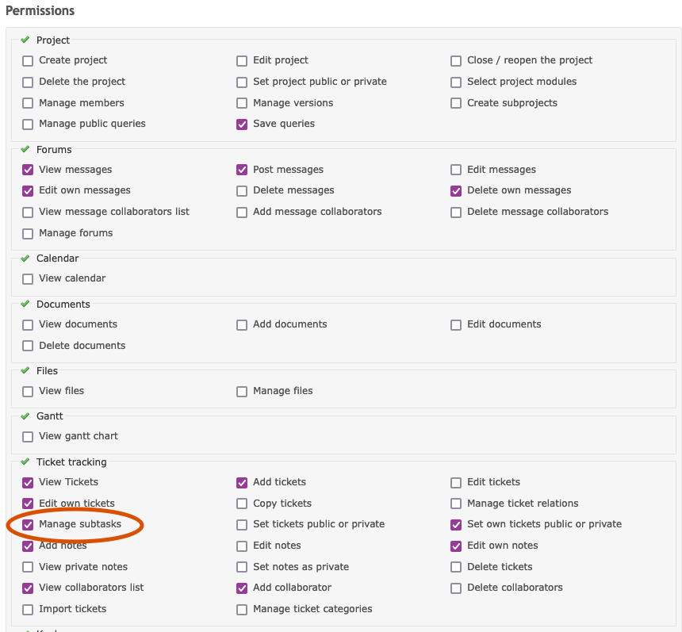

## Development Log

## 2024-10-27

Got blocked yesterday debugging a single last test failure in `tests.test_redmine.TestRedmineIntegration.test_blocked_create_ticket`, but couldn't find logs. Spent far too long working out:
```
if __name__ == '__main__':
    if '-v' in sys.argv:
        setup_logging(logging.DEBUG)
    else:
        setup_logging(logging.ERROR)

    unittest.main(module=None)
```
Notes:
1. This is in the `__main__.py` in the `tests` module.
2. Scans the command line ARGV array to see it it contains the verbose flag for `unittest`
3. If so, load and apply logs setting to enable DEBUG (but not too much)
4. Invoke the main `unittest` module with `module=None` to force standard discorery.

This allows running full test suites with no output (except test metadata, which can be turned off), to enabling debug logs for all or a specific test:

    python -m tests -v -k somes_test_name

This will run specified tests (it's a test-name glob) with DEBUG logging.

In summary: New epic-based sub-ticket creation tests, test cleanup and refactor to show logging.

## 2024-10-26

Added the sanity checks and better testing around loading those resources on startup. That's deployed.

Started adding comprehensive testing around epics and creating sub-tickets and found a problem: Redmine was getting the right data to assign a ticket parent on creation, but was failing to do so. The ticket was created, but without the parent field.

Ug.

So I need more testing to figure out what's different, or add a new approach (/ticket parent). Or both.

Starting with a trivial main to see if I can reproduce in context of redmine module.

By writing increasing lower-level test cases and a test code that stands outside of everything else to isolate code called, I was able to reproduce to "sometimes the parent ID is set correctly" and "sometimes it is not". The varient was *user ID*:
* Admin user and my personal user (also an admin) create parent id correctly
* Unregistered/unknown users are rejected (422, unauthorized)
* Test users, created for the integration test suit to behave like every-day users, **fail to set the parent ID quietly** with the only way to tell inspecting the respose JSON and see "parent" missing from the "issue" dictionary.

Conclusion: There's yet another fine-grain edit permission ("set parent ticket") that is not set correctly. Need to find it.

Found: For each role (`/roles`), there is a specific permission for:
> Permissions
> > Ticket Tracking
> > > [ ] Manage subtickets

Without this check-box marked, the user in that role cannot add a parent ticket, and adding a parent ticket on create fails.



For everyday users to be able to create sub-tickets, this setting will be needed. In the SCN, that normal role is "User".

Updating the specific integration tests to use an admin user in test cases for epics. This will require some test code to confirm that the test-admin exists.


## 2024-10-24

After finding some significant bugs in the latest release, decided to get more rigious with a test-driven-development approach. For this project that means:
1. Identify the missing or buggy behavior.
2. Code one or more test cases that check the expected behavior.
3. Fail those tests until...
4. Write valid working code to provide the correct behavior.
5. Add those tests to the automated test suite.
6. Run the test suite before each change to the `main` or any shared branch.

Today, the first step will be building a tests around a minimal "sane" state after initialization to confirm that all expected *external* resources have been loaded correctly. Specifically, the loaded, parsed and cached data for:
- users
- teams
- priorities (the problem this time)
- trackers
- custom fields

**Approach**: The last step of initialization before giving an "all ready" signal, the bot will run a sanity check to make sure that each of the resources mentioned above is available, non-zero and contain any referenced keys, like:
```
INTAKE_TEAM = "ticket-intake"
INTAKE_TEAM_ID = 19 # FIXME
EPIC_PRIORITY_NAME = "EPIC"
BLOCKED_TEAM_NAME = "blocked"
CHANNEL_MAPPING
TEAM_MAPPING
```

Design: The top-level `Netbot` and any sub-components will implement a `sanity_check() -> dict[str,bool]` to describe it's expected states (with a true or false to indicate if that's working as expected). Sub-system results are aggreagated and returned (using dotted name strings: "netbot.redmine.user_mgr.teams"). Info log at bot startup will show passing state, or the bot sill fail to startup.

Note: Looking over the date return for `/enumerations/issue_priorities.json`, there is no indication of the priority ordering other than the oder in the list (from low to high). Noting that Python 3.7 and later maintain insertion order, so a dict-iterator should work as well as a list iterator, *as long as the key-value pairs as inserted in the correct (reverse!) order* to put the higest priority first whenever iterating.
```
{
  "issue_priorities": [
    {
      "id": 1,
      "name": "Low",
      "is_default": false,
      "active": true
    },
    {
      "id": 2,
      "name": "Normal",
      "is_default": true,
      "active": true
    },
    {
      "id": 3,
      "name": "High",
      "is_default": false,
      "active": true
    },
    {
      "id": 14,
      "name": "EPIC",
      "is_default": false,
      "active": true
    },
    {
      "id": 4,
      "name": "Urgent",
      "is_default": false,
      "active": true
    },
    {
      "id": 5,
      "name": "Immediate",
      "is_default": false,
      "active": true
    }
  ]
}
```

### 2024-09-24

Starting work on ticket 1207, to add admin overrides for all actions that default to self.

Added admin-specific params to allow member assignement for:
* collaborate
* progress
* assign

Adding ticket ID autofill if in ticket thread:
* collaborate
* progress
* assign
* unassign
* resolve
* tracker
* priority
* subject


### 2024-09-05
*Haven't updated in a year. Sorry.*
*I've got the notes, I just haven't put them here. I can if they are needed.*

Using this as a change log (apart from git log).

Fixed #[1206](http://172.16.20.20/issues/1206): Only open tickets are displayed in search results.

Fixed #[1204](http://172.16.20.20/issues/1204): Truncated epics to the most recent 10 (until paging is implemented)


### 2023-08-29
After the ticket workflow discussions, I've been thinking about how to better integrate the "issue source of truth" (was osticket, becomming redmine) with the tools that *humans* use for discussion and issue resolution (Discord). Esther suggested an integration that tracked ticket discussion in specific threads, which was similar to slack-thread-per-issue in a few startups.

The state of this thread tracking can be managed in redmine, using a custom boolean field attached to the issue. When this flag is enabled (for an open ticket), an external cron script can sync comments on a Discord thread with comments on the redmine ticket.

As the netbot.py code is getting complex, it's time to start partitioning the support code into modules:
* DONE First is all the redmine and netbox specific code into their own files.
* Then rebuilding netbot to use the new encapsulated classes. - TODO Test in PROD
* Then adding a job to encapsulate "reqularly manage issue threads":
  * A cron job every N minutes to query "open tickets with discord-thread=Yes modified in the last N minutes"
  * For each:
    * if thread does not exist, create it
    * get discord comments from last N minutes and post as note to ticket
    * get comments from ticket from last N minutes and post to discord thread

Side note about user ids and impersonation: https://www.redmine.org/projects/redmine/wiki/rest_api#User-Impersonation

It looks like it is possible to set a header to impersonate a user:

    X-Redmine-Switch-User: jsmith

This can be used to map Discord users to redmine users. (we'll see how it goes)

### 2023-08-28

Simplified file format, based on authentication needs:

```
redmine:
  command_name:
    query: <url-of-query>
	format: <python str.format string to markdown-ify the query results>
  tickets:
	query: "/issues.json?status_id=open&sort=category:desc,updated_on"
	format: "**[#{issue['id']}](<{self.url}/issues/{issue['id']}>)** {issue['subject']} - {issue['priority']['name']} - {age} old"
	# note: requires {age}, which is generated in the function
```


### 2023-08-27

#### Ticket Workflow
Paul's description of a potential workflow for incoming issues.

1. User has a problem, question, or concern.
2. Sends email to expected address with issue. (currently redmine@seattlecommunitynetwork.org)
3. ticket-system collects new email (currently, an every-5-minute cron task)
4. ticket-system creates and categorizes new ticket from email
    1. ticket-system can also read attributes directly from email (TODO: test)
5. new ticket notification is sent based on data available in ticket (or not)
    1. if there are certain fields filled in (assigned-to, role, etc). a specific notification can be sent.
    2. if not, a more general notification is sent to an "incoming ticket" channel to notify that the system can't automatically route the ticket.
6. Assuming general notification, a person-in-a-specific role for unhandled incoming tickets sets the role/necessary attrs for the ticket.
    2. and the standard notifications to the roles/sites are sent

#### Alternate Flows
* specific vs new generic emails.
* wrong email, wrong address, wrong system (scn.org)
* timeouts on notifications - time-since-last-update crosses a threshold for open tickets results in new notifications.

#### Workflow Notes
* What attributes are required
* There will always be a human involved, so design that from the start.
* But design the system low volume, so the messages stand out and are important.

#### Design Options
* multiple incoming email addresses, one for each site or "area of concern"
* test capabilities of attributes in incoming email.


### 2023-08-25
Deeper design discussion about data, caching, commands and abstractions.

Basic idea -> command -> autocomplete-options -> command+params -> url/request -> response (json) -> parse to dict -> apply filter -> discord

* command
  * options + autocomplete (interface with file-based impl is superclass?)
	* url (with {} substitution tags)
	* filter, perhaps several or iterating-filters, as per (details vs summary)


- commands:
  - my tickets:
		- url:
		- filter:
	- my [user,identity]:
		- url:
		- filter:
	- sites
		- url:
		- filter:
	- site [sitename]
	- tickets [filter, default=open]
	- ticket [number]

TODO: track down SCN guild/team info and add bot restriction.

### 2023-08-24
Today's goals:
* DONE Get Dockerfile in place
* DONE Get compose.yaml in place
* DONE Test full deploy on azure
* DONE Update docs to match
* DONE Get simple redmine calls in place.

Dockerfile and compose.yaml in place and working.

Deployed and working in azure on redmine host.

Turning to....
#### redmine
* for JSON content, it must be set to Content-Type: application/json
* token passed in as a "X-Redmine-API-Key" HTTP header
* https://www.redmine.org/projects/redmine/wiki/Rest_Issues
* https://www.redmine.org/projects/redmine/wiki/Rest_api


GET /issues.json?status_id=open&sort=category:desc,updated_on

Also adding "humize" to manage dates and timedeltas.

```
pip install humanize
pip freeze > requirements.txt
```

Got simple query working, with links, but... the embeds were screwing everything up.

Got on the pycord discord....

```
you can suppress the embeds by wrapping each url in <>
for example:
<https://google.com>
```

Added that to the formatting in the bot, and volia!

Deployed and working on temp instance in azure.

### 2023-08-23
* DONE Start with a *basic* Discord command, written in python. Get the example working end to end.
* DONE Add a command to query netbox.
* DONE Add netbox API call and get auth working.

#### pycord
Starting work on a new bot, from scratch, based on https://github.com/Pycord-Development/pycord

https://github.com/Pycord-Development/pycord/blob/master/examples/app_commands/slash_autocomplete.py

Adding initial requirement.txt and setting up `venv`:

```
python3 -m venv venv
source venv/bin/activate
pip install --upgrade pip
pip install py-cord
pip freeze > requirements.txt
```

Simple example runs but fails auth. How is auth handled? Sending a token in the bot run command.

* https://docs.pycord.dev/en/master/api/data_classes.html#discord.Intents.message_content
* https://support-dev.discord.com/hc/en-us/articles/4404772028055

Using `.env` file for auth, with a var named `DISCORD_TOKEN`

```
pip install python-dotenv
pip freeze > requirements.txt
```

Example bot working.

#### netbox
Moving on to netbox integration.

* code: https://github.com/netbox-community/pynetbox
* docs: https://pynetbox.readthedocs.io/en/latest/

```
pip install pynetbox
pip freeze > requirements.txt
```

The inital command will be getting a list of `sites`.

Code failing due to `ssl.SSLCertVerificationError: [SSL: CERTIFICATE_VERIFY_FAILED] certificate verify failed: self-signed certificate (_ssl.c:1002)`

Looks like self-signed certs fail validation, so it needs to be disabled:

    nb.http_session.verify = False

https://pynetbox.readthedocs.io/en/latest/advanced.html#ssl-verification:
```
>>> import pynetbox
>>> import requests
>>> session = requests.Session()
>>> session.verify = False
>>> nb = pynetbox.api(
...     'http://localhost:8000',
...     token='d6f4e314a5b5fefd164995169f28ae32d987704f'
... )
>>> nb.http_session = session
```

After much tinkering, got a `/site` command working in a reliable way.
